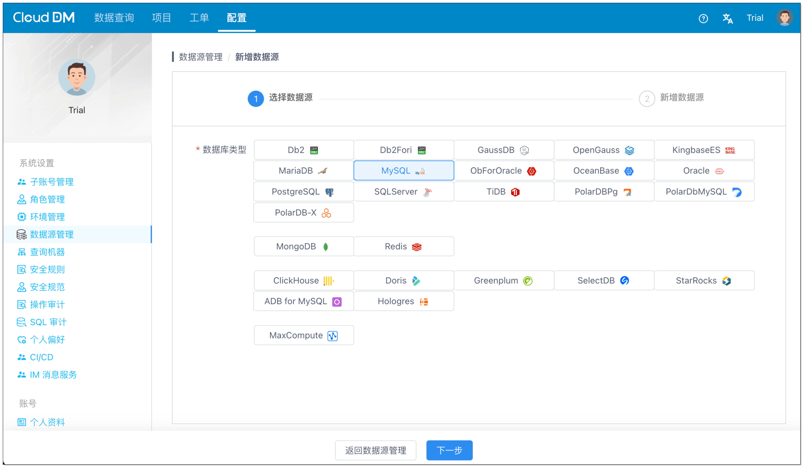
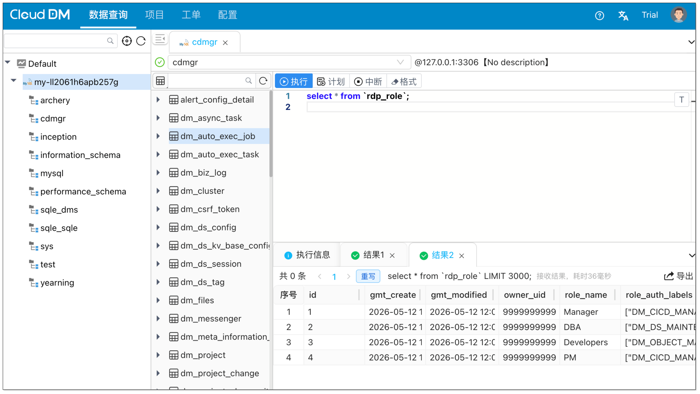

<h1 align="center">CloudDM</h1>

<p align="center">
  一款免费且开源的数据库管理工具，适合团队化使用。它提供了访问控制、数据脱敏、SQL 审核、CI/CD 等能力，并支持跨地区部署。
</p>

<p align="center">
	<a href="https://www.cdmgr.com/"><b>首页</b></a> •
	<a href="https://www.cdmgr.com/docs/intro/product_intro"><b>文档</b></a> •
    <a href="https://www.cdmgr.com/blog"><b>Blog</b></a> •
  <a href="https://gitee.com/clougence/open-cdm"><b>Gitee</b></a> •
  <a href="https://github.com/ClouGence/open-cdm"><b>Github</b></a>
</p>

<p align="center">
    [<a target="_blank" href='./README.cn.md'>中文</a>]
    [<a target="_blank" href='./README.en.md'>English</a>]
</p>


---

## 核心能力

### 数据查询

- 丰富等数据源支持多种数据库
  - MySQL、Oracle、MariaDB、PostgreSQL、IBM DB2、SQL Server、 OceanBase、
  - SAP Hana、StarRocks、Doris、SelectDB、ClickHouse、PolarDB、TiDB、Greenplum
  - Hologres、达梦、高斯数据库、AnalyticDB MySQL、MaxCompute、Redis、MongoDB
- 统一 Web 控制台访问数据库；支持事物、隔离级别、查询计划
- 提供查询编辑器、语法高亮、智能提示、执行计划、结果导出等能力

### 数据库管理

- 支持数据库对象包括：库、模式、表、列、索引、视图、函数、存储过程、触发器、用户、角色等
- 支持可视化管理数据库对象：如 创建、删除、修改、查看属性
- 支持通过 环境、集群。来管理不同数据源。

### 权限控制

- 采用 **资源** 与 **功能** 分离的授权模式
    - 资源权限 可在实例、数据库、Schema、表上进行授权，具体取决于语句类型
    - 功能授权 基于角色的访问控制（RBAC）通过角色授权到人
- 支持 **申请权限**、**赋予权限** 及 **临时权限**

### 数据库 CI/CD

- 提供 **Git Push**、**Web Hook**、**HttpCall** 三种方式触发 CI/CD 流程
- 支持 Gitee 作为变更仓库

### SQL 审核

- 支持 **审核规则**、**安全规范** 和 **数据脱敏**
  - 内置 54 条规则，并支持通过规则脚本自定义扩展
- 支持在 SQL 执行前进行 SQL预检，提示风险或阻断执行

### 协同与流程

- 支持 **SQL审核**、**权限工单**、**变更流程** 三种流程。
- 支持 **手动执行**、**立即执行**、**定时执行** 三种方式执行工单。
- 流程引擎：内置、钉钉、飞书、企业微信。
- 统一认证/SSO：OpenLDAP / OpenID Connect (OIDC) / Windows AD / 钉钉 / 飞书 / 企业微信

## 快速开始

### 安装
CloudDM 支持 **单机模式（Alone）** 和 **集群模式（Console + Sidecar）**，同时支持 **安装包**、**Docker**、**Kubernetes** 多种部署方式。

下面以单机模式部署来展示如何使用。如果你需要安装包部署、集群部署或 Kubernetes 部署，可使用本地打包后生成的安装包和 yml 文件继续部署。完整部署说明请参考 [DEPLOY.cn.md](./DEPLOY.cn.md)。

```bash
# 快速启动
docker run -d --name cgdm-alone -p 8222:8222 bladepipe/cgdm-alone:3.0.7

# 中国地区，使用镜像加速
docker run -d --name cgdm-alone -p 8222:8222 \
  cloudcanal-registry.cn-shanghai.cr.aliyuncs.com/clougence/cgdm-alone:3.0.7
```

### 初始化

通过浏览器访问产品

```
http://localhost:8222
```

> 首次访问会进入初始化向导，默认账号：`admin@cdmgr.com`

### 添加数据源



### 数据查询



## 开源协议

使用商业友好的 [Apache 2.0](https://www.apache.org/licenses/LICENSE-2.0.html) 许可协议。

当前仓库根目录下尚未提供正式的许可证文件，因此本 README 不对许可证做默认推定。
