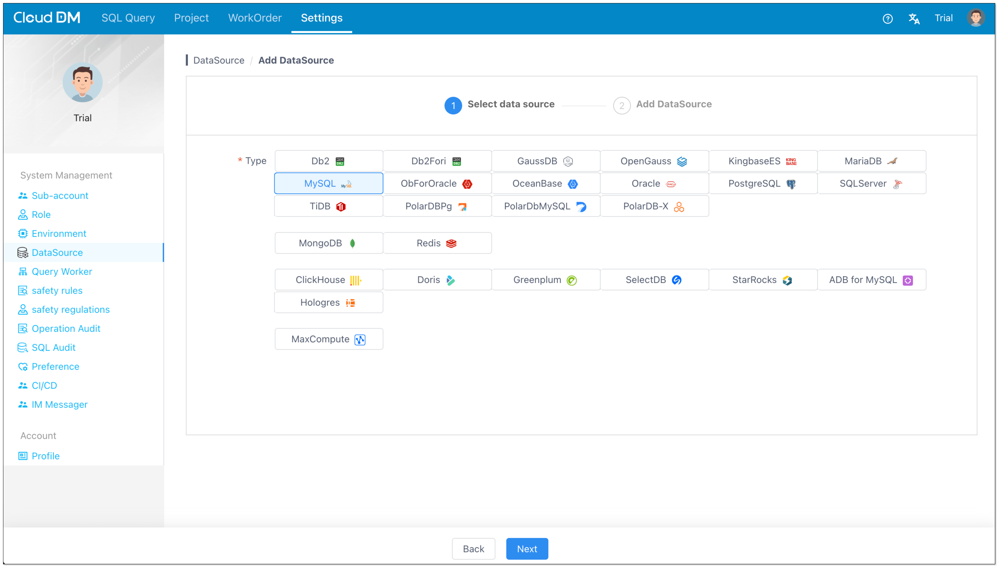
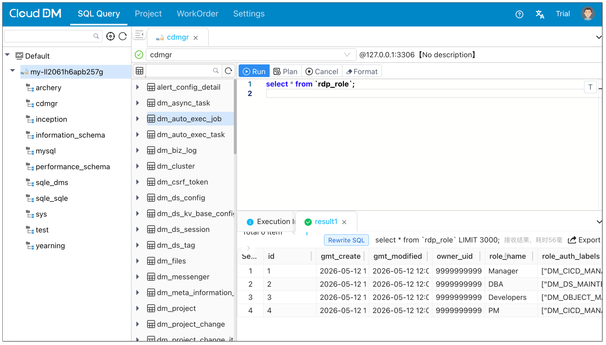

<h1 align="center">CloudDM</h1>

<p align="center">
  A free, open-source database management tool built for teams. It provides access control, data masking, SQL auditing, CI/CD, and multi-region deployment.
</p>

<p align="center">
	<a href="https://www.cdmgr.com/"><b>Home</b></a> •
	<a href="https://www.cdmgr.com/docs/intro/product_intro"><b>Docs</b></a> •
    <a href="https://www.cdmgr.com/blog"><b>Blog</b></a> •
  <a href="https://gitee.com/clougence/open-cdm"><b>Gitee</b></a> •
  <a href="https://github.com/ClouGence/open-cdm"><b>GitHub</b></a>
</p>

<p align="center">
    [<a target="_blank" href='./README.cn.md'>中文</a>]
    [<a target="_blank" href='./README.en.md'>English</a>]
</p>


---

## Core Capabilities

### Data Query

- Broad data source support covering various databases
  - MySQL, Oracle, MariaDB, PostgreSQL, IBM DB2, SQL Server, OceanBase
  - SAP Hana, StarRocks, Doris, SelectDB, ClickHouse, PolarDB, TiDB, Greenplum
  - Hologres, DM (Dameng), GaussDB, AnalyticDB MySQL, MaxCompute, Redis, MongoDB
- Unified web console for database access with transaction, isolation level, and query plan support
- Query editor with syntax highlighting, intelligent suggestions, execution plans, and result export

### Database Management

- Supported database objects: catalog, schema, table, column, index, view, function, stored procedure, trigger, user, role, etc.
- Visual database object management: create, drop, alter, and inspect properties
- Manage data sources via environments and clusters

### Access Control

- **Resource** and **function** decoupled authorization model
    - Resource permissions can be granted at instance, database, schema, and table levels, depending on statement type
    - Function authorization uses role-based access control (RBAC) with role-to-user assignments
- Supports **permission requests**, **permission grants**, and **temporary permissions**

### Database CI/CD

- Three triggering modes: **Git Push**, **Web Hook**, and **HttpCall**
- Supports Gitee as the change repository

### SQL Auditing

- **Audit rules**, **security specifications**, and **data masking**
  - 54 built-in rules with custom rule scripting for extension
- Pre-execution SQL checks that warn or block risky execution

### Collaboration & Workflows

- Three workflow types: **SQL audit**, **permission tickets**, and **change processes**
- Three execution modes: **manual**, **immediate**, and **scheduled**
- Workflow engines: built-in, DingTalk, Feishu, WeCom
- Unified authentication / SSO: OpenLDAP / OpenID Connect (OIDC) / Windows AD / DingTalk / Feishu / WeCom

## Quick Start

### Install
CloudDM supports **Standalone (Alone)** and **Cluster (Console + Sidecar)** modes, with **install package**, **Docker**, and **Kubernetes** deployment options.

The quick start below uses standalone deployment as the shortest path to get started. If you need install-package deployment, cluster deployment, or Kubernetes deployment, you can continue with the generated packages and yml files after building locally. For full deployment details, see [DEPLOY.en.md](./DEPLOY.en.md).

```bash
docker run -d --name cgdm-alone \
  -p 8222:8222 \
  bladepipe/cgdm-alone:3.0.7
```

### Init

Access the product in your browser after startup.

```
http://localhost:8222
```

> On first access, the initialization wizard will launch. 
>
> **Need add an exist MySQL for metadata**.

### Add data source



### Query data



## License

Licensed under the business-friendly [Apache 2.0](https://www.apache.org/licenses/LICENSE-2.0.html) license.

A formal LICENSE file is not yet present at the repository root; this README does not imply any default license assumption.
